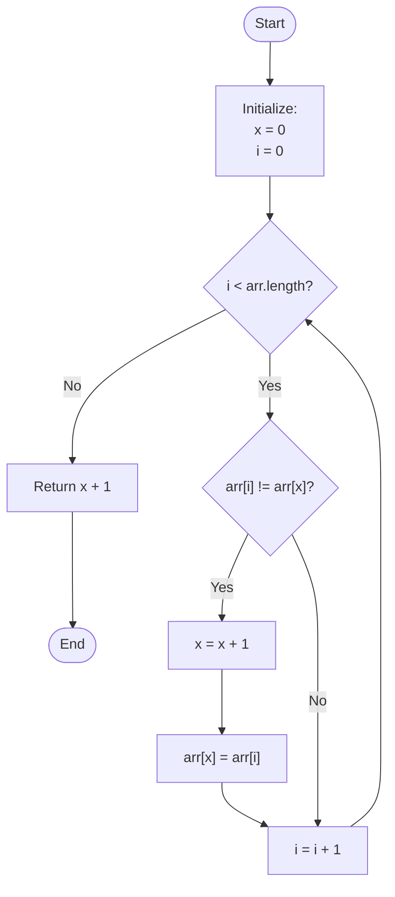

# Unique Elements Algorithm - Flowchart

```mermaid
flowchart TD
    Start([Start]) --> Init["Initialize:<br/>x = 0<br/>i = 0"]
    Init --> CheckLoop{"i < arr.length?"}
    CheckLoop -->|No| Return["Return x + 1"]
    CheckLoop -->|Yes| Compare{"arr[i] != arr[x]?"}

    Compare -->|Yes| IncrementX["x = x + 1"]
    IncrementX --> Assign["arr[x] = arr[i]"]
    Assign --> IncrementI["i = i + 1"]
    IncrementI --> CheckLoop

    Compare -->|No| IncrementI

    Return --> End([End])

```
