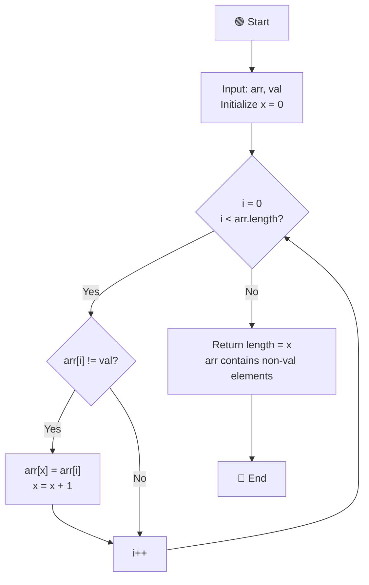

# Remove Elements Algorithm - Flowchart

## Two Pointer Approach

## Algorithm Steps:

1. **Input**: Array and value to remove
2. **Initialize**: Set `x = 0` (pointer to place valid elements)
3. **Traverse**: Loop through array with pointer `i` from 0 to length
4. **Compare**: Check if `arr[i] != val` (element should be kept)
5. **Update**: If element is not the target value:
   - Place element at `arr[x]`
   - Increment `x` to next position
6. **Return**: New length of array after removal (value of x)

## Example:
- Input: `[3, 1, 5, 5, 2, 1, 6, 3, 2, 7]`, val = `5`
- Output: `[3, 1, 2, 1, 6, 3, 2, 7, _, _]` → length = `8`

## Time Complexity: O(n)
## Space Complexity: O(1) - In-place algorithm
