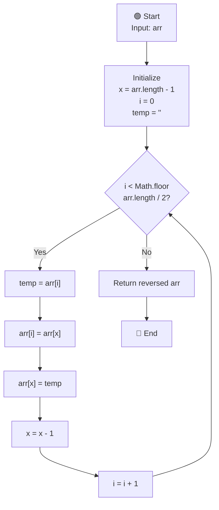

# Reverse String Algorithm - Flowchart

## Two Pointer Approach

## Algorithm Steps:

1. **Initialize Pointers**:
   - `i = 0` (pointer at start)
   - `x = arr.length - 1` (pointer at end)
   - `temp = ''` (temporary variable for swap)

2. **Loop Condition**: Iterate only till middle of array
   - `i < Math.floor(arr.length / 2)`

3. **Swap Elements**:
   - Store `arr[i]` in `temp`
   - Move `arr[x]` to `arr[i]`
   - Move `temp` (original `arr[i]`) to `arr[x]`

4. **Move Pointers**:
   - Decrement `x` by 1
   - Increment `i` by 1

5. **Return**: Reversed array

## Example:
- Input: `['a', 'k', 's', 'h', 'a', 'y']`
- Output: `['y', 'a', 'h', 's', 'k', 'a']`

## Complexity:
- **Time**: O(n/2) = O(n) - Only iterate till middle
- **Space**: O(1) - In-place algorithm, only temp variable used
