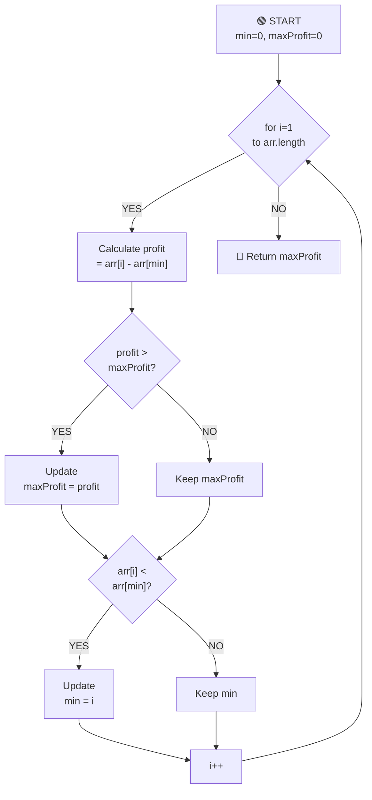

# Max Profit Algorithm - Complete Breakdown

## Overall Algorithm Logic



---

## Detailed Iteration Breakdown

### Initial State
```
Array: [7, 1, 5, 3, 6, 4]
       0  1  2  3  4  5   (indices)

min = 0        (pointer to minimum price index)
maxProfit = 0  (best profit found so far)
```

---

## ITERATION 1: i=1
```
Current state:
Array: [7, 1, 5, 3, 6, 4]
       ↑  ↑
      min i

arr[i] = 1, arr[min] = 7

Check 1: profit = arr[i] - arr[min] = 1 - 7 = -6
         Is -6 > maxProfit (0)? NO
         maxProfit stays 0

Check 2: Is arr[i] (1) < arr[min] (7)? YES ✓
         Update min = 1

Result: min=1, maxProfit=0
Array: [7, 1, 5, 3, 6, 4]
          ↑
         min (updated from 0 to 1)
```

---

## ITERATION 2: i=2 ⭐ PROFIT UPDATE
```
Current state:
Array: [7, 1, 5, 3, 6, 4]
          ↑  ↑
         min i

arr[i] = 5, arr[min] = 1

Check 1: profit = arr[i] - arr[min] = 5 - 1 = 4
         Is 4 > maxProfit (0)? YES ✓
         Update maxProfit = 4

Check 2: Is arr[i] (5) < arr[min] (1)? NO
         min stays 1

Result: min=1, maxProfit=4
Array: [7, 1, 5, 3, 6, 4]
          ↑  ↑
         min i

✓ NEW PROFIT: Buy at 1, Sell at 5 = Profit of 4
```

---

## ITERATION 3: i=3
```
Current state:
Array: [7, 1, 5, 3, 6, 4]
          ↑        ↑
         min       i

arr[i] = 3, arr[min] = 1

Check 1: profit = arr[i] - arr[min] = 3 - 1 = 2
         Is 2 > maxProfit (4)? NO
         maxProfit stays 4

Check 2: Is arr[i] (3) < arr[min] (1)? NO
         min stays 1

Result: min=1, maxProfit=4
Array: [7, 1, 5, 3, 6, 4]
          ↑        ↑
         min       i

(No change - price dropped but profit not better)
```

---

## ITERATION 4: i=4 ⭐⭐ BEST PROFIT UPDATE
```
Current state:
Array: [7, 1, 5, 3, 6, 4]
          ↑           ↑
         min          i

arr[i] = 6, arr[min] = 1

Check 1: profit = arr[i] - arr[min] = 6 - 1 = 5
         Is 5 > maxProfit (4)? YES ✓
         Update maxProfit = 5

Check 2: Is arr[i] (6) < arr[min] (1)? NO
         min stays 1

Result: min=1, maxProfit=5
Array: [7, 1, 5, 3, 6, 4]
          ↑           ↑
         min          i

✓✓ NEW BEST PROFIT: Buy at 1, Sell at 6 = Profit of 5
```

---

## ITERATION 5: i=5
```
Current state:
Array: [7, 1, 5, 3, 6, 4]
          ↑              ↑
         min             i

arr[i] = 4, arr[min] = 1

Check 1: profit = arr[i] - arr[min] = 4 - 1 = 3
         Is 3 > maxProfit (5)? NO
         maxProfit stays 5

Check 2: Is arr[i] (4) < arr[min] (1)? NO
         min stays 1

Result: min=1, maxProfit=5
Array: [7, 1, 5, 3, 6, 4]
          ↑              ↑
         min             i

(i reaches end of array, loop terminates)
```

---

## 🏁 FINAL RESULT
```
Array: [7, 1, 5, 3, 6, 4]
       0  1  2  3  4  5

Final State:
min = 1
maxProfit = 5

✓ Maximum Profit: 5
✓ Buy at day 1 (price = 1)
✓ Sell at day 4 (price = 6)
```
