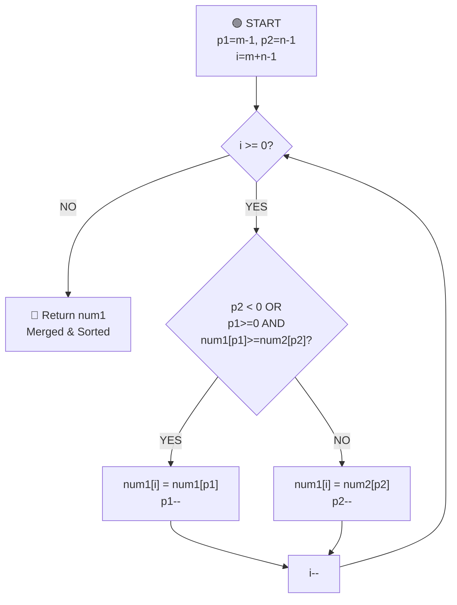

# Merge Sorted Arrays - Complete Breakdown

## Overall Algorithm Logic



---

## Detailed Iteration Breakdown

### Initial State
```
num1 = [1, 2, 4, 0, 0, 0]  (size = m+n = 6, valid m=3 elements)
num2 = [2, 3, 5]             (size = n = 3)
m = 3, n = 3

Pointers:
p1 = m - 1 = 2               (points to last valid element in num1 = 4)
p2 = n - 1 = 2               (points to last element in num2 = 5)
i = m + n - 1 = 5            (points to last position in result array)
```

---

## ITERATION 1: i=5
```
Current state:
num1: [1, 2, 4, 0, 0, 0]
       0  1  2  3  4  5  (indices)
                ↑     ↑
                p1    i

num2: [2, 3, 5]
       0  1  2  (indices)
             ↑
             p2

Values:
- p1 = 2, num1[p1] = 4
- p2 = 2, num2[p2] = 5
- i = 5

Check condition:
  Is p2 < 0? NO (p2 = 2)
  OR Is p1 >= 0 AND num1[p1] >= num2[p2]?
     p1 >= 0? YES (p1 = 2)
     num1[p1] >= num2[p2]? 4 >= 5? NO
  
  Overall: NO (take from num2)

Action: num1[i] = num2[p2]
        num1[5] = 5
        p2-- → p2 = 1

Result:
num1: [1, 2, 4, 0, 0, 5]
       0  1  2  3  4  5
                ↑     ↑
                p1    i

num2: [2, 3, 5]
       0  1  2
          ↑
          p2
```

---

## ITERATION 2: i=4
```
Current state:
num1: [1, 2, 4, 0, 0, 5]
       0  1  2  3  4  5
                ↑     ↑
                p1    i

num2: [2, 3, 5]
       0  1  2
          ↑
          p2

Values:
- p1 = 2, num1[p1] = 4
- p2 = 1, num2[p2] = 3
- i = 4

Check condition:
  Is p2 < 0? NO (p2 = 1)
  OR Is p1 >= 0 AND num1[p1] >= num2[p2]?
     p1 >= 0? YES (p1 = 2)
     num1[p1] >= num2[p2]? 4 >= 3? YES ✓
  
  Overall: YES (take from num1)

Action: num1[i] = num1[p1]
        num1[4] = 4
        p1-- → p1 = 1

Result:
num1: [1, 2, 4, 0, 4, 5]
       0  1  2  3  4  5
          ↑           ↑
          p1          i

num2: [2, 3, 5]
       0  1  2
          ↑
          p2
```

---

## ITERATION 3: i=3
```
Current state:
num1: [1, 2, 4, 0, 4, 5]
       0  1  2  3  4  5
          ↑        ↑
          p1       i

num2: [2, 3, 5]
       0  1  2
       ↑
       p2

Values:
- p1 = 1, num1[p1] = 2
- p2 = 1, num2[p2] = 3
- i = 3

Check condition:
  Is p2 < 0? NO (p2 = 1)
  OR Is p1 >= 0 AND num1[p1] >= num2[p2]?
     p1 >= 0? YES (p1 = 1)
     num1[p1] >= num2[p2]? 2 >= 3? NO
  
  Overall: NO (take from num2)

Action: num1[i] = num2[p2]
        num1[3] = 3
        p2-- → p2 = 0

Result:
num1: [1, 2, 4, 3, 4, 5]
       0  1  2  3  4  5
          ↑     ↑
          p1    i

num2: [2, 3, 5]
       0  1  2
       ↑
       p2
```

---

## ITERATION 4: i=2
```
Current state:
num1: [1, 2, 4, 3, 4, 5]
       0  1  2  3  4  5
       ↑     ↑
       p1    i

num2: [2, 3, 5]
       0  1  2
       ↑
       p2

Values:
- p1 = 1, num1[p1] = 2
- p2 = 0, num2[p2] = 2
- i = 2

Check condition:
  Is p2 < 0? NO (p2 = 0)
  OR Is p1 >= 0 AND num1[p1] >= num2[p2]?
     p1 >= 0? YES (p1 = 1)
     num1[p1] >= num2[p2]? 2 >= 2? YES ✓
  
  Overall: YES (take from num1)

Action: num1[i] = num1[p1]
        num1[2] = 2
        p1-- → p1 = 0

Result:
num1: [1, 2, 2, 3, 4, 5]
       0  1  2  3  4  5
       ↑  ↑
       p1 i

num2: [2, 3, 5]
       0  1  2
       ↑
       p2
```

---

## ITERATION 5: i=1
```
Current state:
num1: [1, 2, 2, 3, 4, 5]
       0  1  2  3  4  5
       ↑     ↑
       p1    i

num2: [2, 3, 5]
       0  1  2
       ↑
       p2

Values:
- p1 = 0, num1[p1] = 1
- p2 = 0, num2[p2] = 2
- i = 1

Check condition:
  Is p2 < 0? NO (p2 = 0)
  OR Is p1 >= 0 AND num1[p1] >= num2[p2]?
     p1 >= 0? YES (p1 = 0)
     num1[p1] >= num2[p2]? 1 >= 2? NO
  
  Overall: NO (take from num2)

Action: num1[i] = num2[p2]
        num1[1] = 2
        p2-- → p2 = -1

Result:
num1: [1, 2, 2, 3, 4, 5]
       0  1  2  3  4  5
       ↑  ↑
       p1 i

num2: [2, 3, 5]
       0  1  2
   (p2 = -1, out of bounds)
```

---

## ITERATION 6: i=0
```
Current state:
num1: [1, 2, 2, 3, 4, 5]
       0  1  2  3  4  5
       ↑  ↑
       p1 i

num2: [2, 3, 5]
       0  1  2
   (p2 = -1, out of bounds)

Values:
- p1 = 0, num1[p1] = 1
- p2 = -1 (out of bounds)
- i = 0

Check condition:
  Is p2 < 0? YES ✓ (p2 = -1)
  
  Overall: YES (num2 exhausted, take from num1)

Action: num1[i] = num1[p1]
        num1[0] = 1
        p1-- → p1 = -1

Result:
num1: [1, 2, 2, 3, 4, 5]
       0  1  2  3  4  5
       ↑
       i (loop terminates)

(Both p1 and p2 out of bounds)
```

---

## 🏁 FINAL RESULT
```
num1: [1, 2, 2, 3, 4, 5]
```

---


## Key Insights

1. **Backward Iteration**: We iterate from the end to avoid overwriting unprocessed elements
2. **Three Pointers**: 
   - `p1`: tracks num1's valid elements
   - `p2`: tracks num2's elements
   - `i`: tracks the result position
3. **Greedy Comparison**: Always place the larger element at position `i`
4. **Edge Case Handling**: When one array is exhausted (p < 0), remaining elements are placed automatically
5. **Time Complexity**: O(m + n) - single backward pass
6. **Space Complexity**: O(1) - merge in-place, no extra arrays needed
