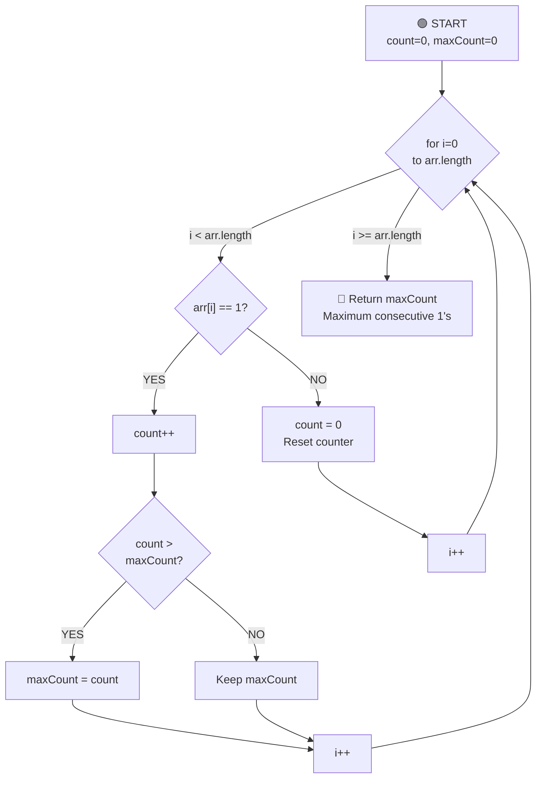

# Max Consecutive Ones - Complete Breakdown

## Overall Algorithm Logic



---

## Detailed Iteration Breakdown

### Initial State
```
arr = [1, 1, 0, 1, 1, 1, 0, 1]
      0  1  2  3  4  5  6  7  (indices)

count = 0      (current consecutive 1's count)
maxCount = 0   (highest count found so far)
```

---

## ITERATION 1: i=0
```
Current state:
arr: [1, 1, 0, 1, 1, 1, 0, 1]
     0  1  2  3  4  5  6  7
     ↑
     i

Values:
- arr[i] = 1
- count = 0
- maxCount = 0

Check: arr[i] == 1?  →  YES ✓
Action 1: count++  →  count becomes 1
Action 2: Is count (1) > maxCount (0)?  →  YES ✓
          Update maxCount = 1

Result: count=1, maxCount=1

arr: [1, 1, 0, 1, 1, 1, 0, 1]
      0  1  2  3  4  5  6  7
      ↑
      i

Status: Found first 1, updated max to 1
```

---

## ITERATION 2: i=1
```
Current state:
arr: [1, 1, 0, 1, 1, 1, 0, 1]
      0  1  2  3  4  5  6  7
      ↑
      i

Values:
- arr[i] = 1
- count = 1
- maxCount = 1

Check: arr[i] == 1?  →  YES ✓
Action 1: count++  →  count becomes 2
Action 2: Is count (2) > maxCount (1)?  →  YES ✓
          Update maxCount = 2

Result: count=2, maxCount=2

arr: [1, 1, 0, 1, 1, 1, 0, 1]
      0  1  2  3  4  5  6  7
         ↑
         i

Status: Found consecutive 1, updated max to 2
```

---

## ITERATION 3: i=2 ⭐ RESET
```
Current state:
arr: [1, 1, 0, 1, 1, 1, 0, 1]
      0  1  2  3  4  5  6  7
         ↑
         i

Values:
- arr[i] = 0
- count = 2
- maxCount = 2

Check: arr[i] == 1?  →  NO
Action: Reset count = 0

Result: count=0, maxCount=2 (stays same)

arr: [1, 1, 0, 1, 1, 1, 0, 1]
      0  1  2  3  4  5  6  7
            ↑
            i

Status: Hit zero, reset counter (count=0)
```

---

## ITERATION 4: i=3
```
Current state:
arr: [1, 1, 0, 1, 1, 1, 0, 1]
      0  1  2  3  4  5  6  7
            ↑
            i

Values:
- arr[i] = 1
- count = 0
- maxCount = 2

Check: arr[i] == 1?  →  YES ✓
Action 1: count++  →  count becomes 1
Action 2: Is count (1) > maxCount (2)?  →  NO
          Keep maxCount = 2

Result: count=1, maxCount=2

arr: [1, 1, 0, 1, 1, 1, 0, 1]
      0  1  2  3  4  5  6  7
               ↑
               i

Status: Found new 1 after zero, count restarted at 1
```

---

## ITERATION 5: i=4 ⭐ NEW SEQUENCE
```
Current state:
arr: [1, 1, 0, 1, 1, 1, 0, 1]
      0  1  2  3  4  5  6  7
               ↑
               i

Values:
- arr[i] = 1
- count = 1
- maxCount = 2

Check: arr[i] == 1?  →  YES ✓
Action 1: count++  →  count becomes 2
Action 2: Is count (2) > maxCount (2)?  →  NO
          Keep maxCount = 2

Result: count=2, maxCount=2

arr: [1, 1, 0, 1, 1, 1, 0, 1]
      0  1  2  3  4  5  6  7
                  ↑
                  i

Status: Another consecutive 1, count=2
```

---

## ITERATION 6: i=5 ⭐⭐ NEW MAXIMUM
```
Current state:
arr: [1, 1, 0, 1, 1, 1, 0, 1]
      0  1  2  3  4  5  6  7
                     ↑
                     i

Values:
- arr[i] = 1
- count = 2
- maxCount = 2

Check: arr[i] == 1?  →  YES ✓
Action 1: count++  →  count becomes 3
Action 2: Is count (3) > maxCount (2)?  →  YES ✓
          Update maxCount = 3

Result: count=3, maxCount=3

arr: [1, 1, 0, 1, 1, 1, 0, 1]
      0  1  2  3  4  5  6  7
                        ↑
                        i

Status: Found 3 consecutive 1's! New maximum: 3
```

---

## ITERATION 7: i=6 ⭐ RESET AGAIN
```
Current state:
arr: [1, 1, 0, 1, 1, 1, 0, 1]
      0  1  2  3  4  5  6  7
                           ↑
                           i

Values:
- arr[i] = 0
- count = 3
- maxCount = 3

Check: arr[i] == 1?  →  NO
Action: Reset count = 0

Result: count=0, maxCount=3 (stays same)

arr: [1, 1, 0, 1, 1, 1, 0, 1]
      0  1  2  3  4  5  6  7
                              ↑
                              i

Status: Hit zero, reset counter. maxCount remains 3
```

---

## ITERATION 8: i=7
```
Current state:
arr: [1, 1, 0, 1, 1, 1, 0, 1]
      0  1  2  3  4  5  6  7
                                ↑
                                i

Values:
- arr[i] = 1
- count = 0
- maxCount = 3

Check: arr[i] == 1?  →  YES ✓
Action 1: count++  →  count becomes 1
Action 2: Is count (1) > maxCount (3)?  →  NO
          Keep maxCount = 3

Result: count=1, maxCount=3

arr: [1, 1, 0, 1, 1, 1, 0, 1]
     0  1  2  3  4  5  6  7
                                   ↑
                                   i (end of array)

Status: Final 1 found, not enough to beat max of 3
```

---

## 🏁 FINAL RESULT
```
arr: [1, 1, 0, 1, 1, 1, 0, 1]

Final State:
count = 1
maxCount = 3
```
## Key Insights

1. **Two Counters**:
   - `count`: Current consecutive 1's streak
   - `maxCount`: Best streak found so far

2. **Update Logic**:
   - When arr[i] == 1: Increment count
   - When count > maxCount: Update maxCount
   - When arr[i] == 0: Reset count to 0

3. **Key Moments**:
   - Iteration 0-1: First streak (1, 1) = 2
   - Iteration 2: Reset at 0
   - Iteration 3-5: Second streak (1, 1, 1) = 3 ⭐ NEW MAX
   - Iteration 6: Reset at 0
   - Iteration 7: Final single 1 = 1 (not enough to beat max)

4. **Tracking Consecutive Sequences**:
   ```
   Sequence 1: [1, 1]        at indices 0-1    (length 2)
   Sequence 2: [1, 1, 1]     at indices 3-5    (length 3) ✓ MAXIMUM
   Sequence 3: [1]           at index 7        (length 1)
   ```

5. **Time Complexity**: O(n) - Single pass through array
6. **Space Complexity**: O(1) - Only two variables used
