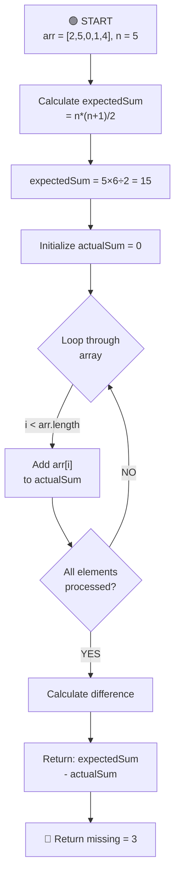

# Missing Number - Complete Breakdown

## Overall Algorithm Logic



---

## Detailed Iteration Breakdown

### Initial State

```
arr = [2, 5, 0, 1, 4]
      0  1  2  3  4  (indices)

expectedSum = 5 * 6 / 2 = 15
actualSum = 0   (will accumulate sum of array elements)
```

---

## ITERATION 1: i=0

```
Current state:
arr: [2, 5, 0, 1, 4]
     0  1  2  3  4
     ↑
     i

Values:
- arr[i] = 2
- actualSum = 0

Action: actualSum += arr[0]
Result: actualSum = 0 + 2 = 2

arr: [2, 5, 0, 1, 4]
     0  1  2  3  4
     ↑
     i

Status: Added first element
```

---

## ITERATION 2: i=1

```
Current state:
arr: [2, 5, 0, 1, 4]
     0  1  2  3  4
        ↑
        i

Values:
- arr[i] = 5
- actualSum = 2

Action: actualSum += arr[1]
Result: actualSum = 2 + 5 = 7

arr: [2, 5, 0, 1, 4]
     0  1  2  3  4
        ↑
        i

Status: Running sum updates
```

---

## ITERATION 3: i=2

```
Current state:
arr: [2, 5, 0, 1, 4]
     0  1  2  3  4
           ↑
           i

Values:
- arr[i] = 0
- actualSum = 7

Action: actualSum += arr[2]
Result: actualSum = 7 + 0 = 7

arr: [2, 5, 0, 1, 4]
     0  1  2  3  4
           ↑
           i

Status: Zero doesn't change the sum
```

---

## ITERATION 4: i=3

```
Current state:
arr: [2, 5, 0, 1, 4]
     0  1  2  3  4
              ↑
              i

Values:
- arr[i] = 1
- actualSum = 7

Action: actualSum += arr[3]
Result: actualSum = 7 + 1 = 8

arr: [2, 5, 0, 1, 4]
     0  1  2  3  4
              ↑
              i

Status: Continuing to accumulate sum
```

---

## ITERATION 5: i=4 ⭐ FINAL

```
Current state:
arr: [2, 5, 0, 1, 4]
     0  1  2  3  4
                 ↑
                 i

Values:
- arr[i] = 4
- actualSum = 8

Action: actualSum += arr[4]
Result: actualSum = 8 + 4 = 12

arr: [2, 5, 0, 1, 4]
     0  1  2  3  4
                 ↑
                 i

Status: All elements summed
```

---

## CALCULATION & RESULT

```
expectedSum = 15
actualSum = 12

Missing Number = expectedSum - actualSum
               = 15 - 12
               = 3 ✓
```

---

## Algorithm Explanation

### Math Formula Used

The sum of first n natural numbers (0 to n) = **n × (n + 1) ÷ 2**

### Key Steps

1. **Calculate Expected Sum**: Sum of all numbers from 0 to n should equal `n*(n+1)/2`
2. **Calculate Actual Sum**: Add all elements in the given array
3. **Find Difference**: The missing number = Expected Sum - Actual Sum

### Why It Works

- Expected sum includes ALL numbers from 0 to n
- Actual sum includes only the numbers present in array
- The difference gives us the one number that's missing

---

## Complexity Analysis

1. **Time Complexity**: **O(n)**
   - Single loop through the array to calculate actualSum
   - Formula calculation is O(1)

2. **Space Complexity**: **O(1)**
   - Only using two variables: `expectedSum` and `actualSum`
   - No additional data structures needed

---

## Edge Cases

1. **Missing number is 0**:
   - arr = [1, 2, 3], n = 3
   - expectedSum = 6, actualSum = 6, missing = 0 ✓

2. **Missing number is n**:
   - arr = [0, 1, 2], n = 3
   - expectedSum = 6, actualSum = 3, missing = 3 ✓

3. **Large n**:
   - Works efficiently even for n up to 10^4
   - Time: O(n), Space: O(1) makes it scalable
