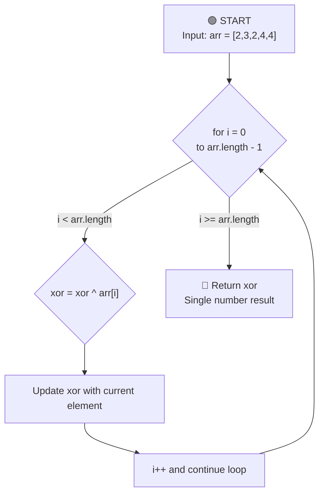

## Overall Algorithm Logic

## Detailed Explanation

- Start with `xor = 0`.
- Iterate over each value in the array.
- XORing a number with itself cancels it out: `x ^ x = 0`.
- XORing any number with `0` returns the number: `0 ^ x = x`.
- Every duplicate pair in the array becomes `0`, leaving only the single non-duplicate value.

## Example Walkthrough

For `arr = [2, 3, 2, 4, 4]`:

1. `xor = 0 ^ 2 = 2`
2. `xor = 2 ^ 3 = 1`
3. `xor = 1 ^ 2 = 3`
4. `xor = 3 ^ 4 = 7`
5. `xor = 7 ^ 4 = 3`

Final output: `3`.

## Key Points

- **Single-pass algorithm**: every element is processed once.
- **Constant extra space**: only one numeric variable is used.
- **Works when** every number except one appears exactly twice.

## Complexity

- Time Complexity: `O(n)`
- Space Complexity: `O(1)`
