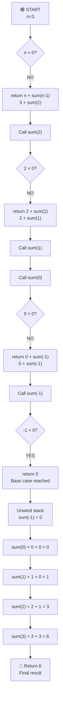

# Sum of First N Numbers - (using recursion)

## Code

```javascript
// sum of first n numbers
// using recursion

const num = 3;

const sum = (n) => {
  if (n < 0) return 0;
  return n + sum(n - 1);
};

console.log(sum(num));
```

## Overall Algorithm Logic



## Example Walkthrough

For n=3:

- sum(3) = 3 + sum(2)
- sum(2) = 2 + sum(1)
- sum(1) = 1 + sum(0)
- sum(0) = 0 + sum(-1)
- sum(-1) = 0 (base case)
- Unwinding: 0 + 0 = 0, 1 + 0 = 1, 2 + 1 = 3, 3 + 3 = 6

**Result:** 6

## Complexity Analysis

- **Time Complexity:** O(n) - Each call makes one recursive call until n=0
- **Space Complexity:** O(n) - Recursion stack depth is n
- **Note:** This is not the most efficient way (iterative would be O(1) space), but demonstrates recursion
