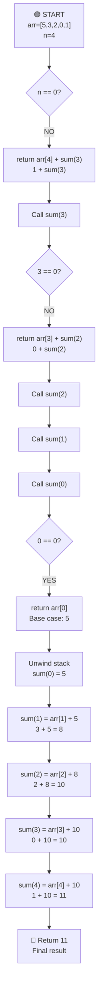

# Sum of All Array Numbers - (using recursion)

## Code

```javascript
// input = [5, 3, 2, 0, 1]
// need to find the sum of all the numbers in the array (using recursion)

const arr = [5, 3, 2, 0, 1];

const sum = (n) => {
  if (n == 0) return arr[n];
  return arr[n] + sum(n - 1);
};

console.log(sum(arr.length - 1));
```

## Overall Algorithm Logic



## Example Walkthrough

For arr = [5, 3, 2, 0, 1]:

- sum(4) = arr[4] + sum(3) = 1 + sum(3)
- sum(3) = arr[3] + sum(2) = 0 + sum(2)
- sum(2) = arr[2] + sum(1) = 2 + sum(1)
- sum(1) = arr[1] + sum(0) = 3 + sum(0)
- sum(0) = arr[0] = 5 (base case)
- Unwinding: 3 + 5 = 8, 2 + 8 = 10, 0 + 10 = 10, 1 + 10 = 11

**Result:** 11

## Complexity Analysis

- **Time Complexity:** O(n) - Each call makes one recursive call until n=0
- **Space Complexity:** O(n) - Recursion stack depth is n
- **Note:** This demonstrates recursion but is less efficient than iterative approach
