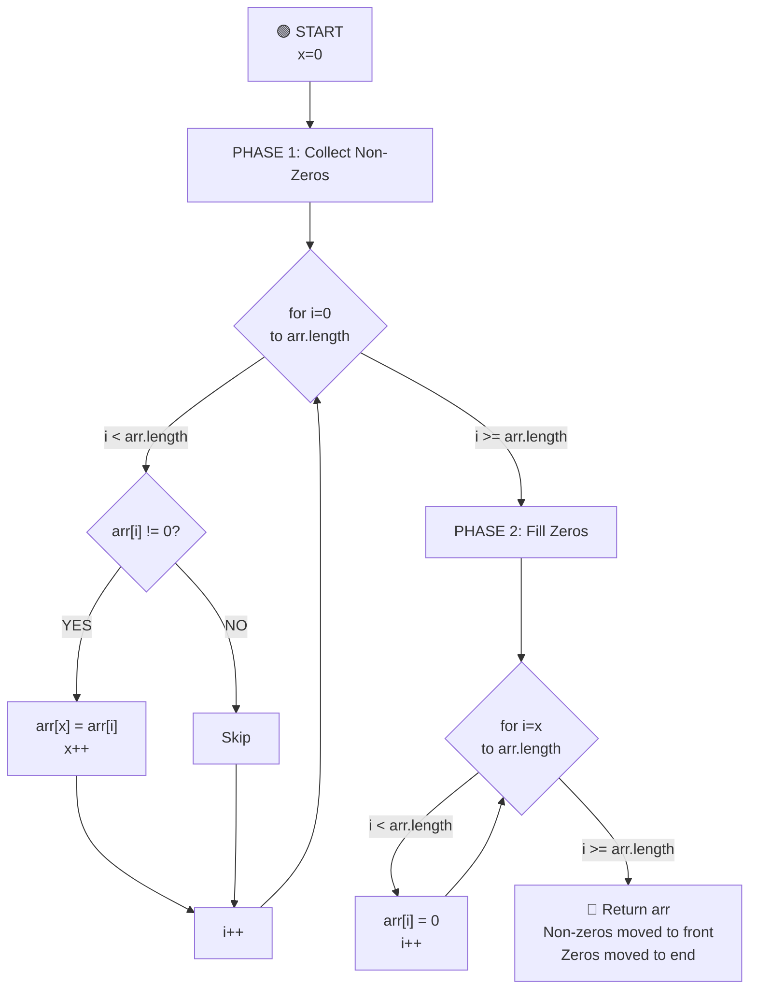

# Move Zeros Algorithm - Complete Breakdown

## Overall Algorithm Logic



---

## Detailed Iteration Breakdown

### Initial State
```
arr = [0, 1, 0, 3, 12]
      0  1  2  3  4    (indices)

x = 0        (pointer to place non-zero elements)

PHASE 1: Collect all non-zero elements
```

---

## PHASE 1: Collecting Non-Zero Elements

### ITERATION 1: i=0
```
Current state:
arr: [0, 1, 0, 3, 12]
     0  1  2  3  4
     ↑
     i,x

Values:
- x = 0
- i = 0
- arr[i] = 0

Check: arr[i] != 0?  →  0 != 0?  →  NO
Action: Skip (cannot place zero)

Result: x stays 0, i moves to 1

arr: [0, 1, 0, 3, 12]
     0  1  2  3  4
        ↑
        i
     ↑
     x
```

---

## ITERATION 2: i=1
```
Current state:
arr: [0, 1, 0, 3, 12]
     0  1  2  3  4
        ↑
        i
     ↑
     x

Values:
- x = 0
- i = 1
- arr[i] = 1

Check: arr[i] != 0?  →  1 != 0?  →  YES ✓
Action: arr[x] = arr[i]
        arr[0] = 1
        x++

Result: x becomes 1, arr[0] now contains 1

arr: [1, 1, 0, 3, 12]
     0  1  2  3  4
           ↑
           i
        ↑
        x
```

---

## ITERATION 3: i=2
```
Current state:
arr: [1, 1, 0, 3, 12]
     0  1  2  3  4
           ↑
           i
        ↑
        x

Values:
- x = 1
- i = 2
- arr[i] = 0

Check: arr[i] != 0?  →  0 != 0?  →  NO
Action: Skip (cannot place zero)

Result: x stays 1, i moves to 3

arr: [1, 1, 0, 3, 12]
     0  1  2  3  4
              ↑
              i
        ↑
        x
```

---

## ITERATION 4: i=3
```
Current state:
arr: [1, 1, 0, 3, 12]
     0  1  2  3  4
              ↑
              i
        ↑
        x

Values:
- x = 1
- i = 3
- arr[i] = 3

Check: arr[i] != 0?  →  3 != 0?  →  YES ✓
Action: arr[x] = arr[i]
        arr[1] = 3
        x++

Result: x becomes 2, arr[1] now contains 3

arr: [1, 3, 0, 3, 12]
     0  1  2  3  4
                 ↑
                 i
           ↑
           x
```

---

## ITERATION 5: i=4
```
Current state:
arr: [1, 3, 0, 3, 12]
     0  1  2  3  4
                 ↑
                 i
           ↑
           x

Values:
- x = 2
- i = 4
- arr[i] = 12

Check: arr[i] != 0?  →  12 != 0?  →  YES ✓
Action: arr[x] = arr[i]
        arr[2] = 12
        x++

Result: x becomes 3, arr[2] now contains 12

arr: [1, 3, 12, 3, 12]
     0  1  2   3  4
                    ↑
                    i
              ↑
              x

PHASE 1 COMPLETE: x = 3 (number of non-zero elements)
```

---

## PHASE 2: Filling Remaining Positions with Zeros

### ITERATION 1: i=3
```
Current state:
arr: [1, 3, 12, 3, 12]
     0  1  2   3  4
           ↑
           i

Loop starts from i = x = 3

Values:
- i = 3
- arr[i] = 3

Action: arr[i] = 0
        arr[3] = 0

Result:
arr: [1, 3, 12, 0, 12]
     0  1  2   3  4
                 ↑
                 i
```

---

### ITERATION 2: i=4
```
Current state:
arr: [1, 3, 12, 0, 12]
     0  1  2   3  4
                    ↑
                    i

Values:
- i = 4
- arr[i] = 12

Action: arr[i] = 0
        arr[4] = 0

Result:
arr: [1, 3, 12, 0, 0]
     0  1  2   3  4
                       ↑
                       i (out of bounds, loop ends)

✓ ALGORITHM COMPLETE!
```

---

## 🏁 FINAL RESULT
```
arr: [1, 3, 12, 0, 0]
     ✓ All non-zero elements moved to front
     ✓ Relative order maintained: 1, 3, 12
     ✓ All zeros moved to end
```

---

## Phase 1 Summary: Collecting Non-Zeros

| Iteration | i | x | arr[i] | Condition | Action | Result |
|-----------|---|---|--------|-----------|--------|--------|
| 1 | 0 | 0 | 0 | 0 != 0? NO | Skip | arr stays same, x=0 |
| 2 | 1 | 0 | 1 | 1 != 0? YES | arr[0]=1, x++ | arr[0]=1, x=1 |
| 3 | 2 | 1 | 0 | 0 != 0? NO | Skip | arr stays same, x=1 |
| 4 | 3 | 1 | 3 | 3 != 0? YES | arr[1]=3, x++ | arr[1]=3, x=2 |
| 5 | 4 | 2 | 12 | 12 != 0? YES | arr[2]=12, x++ | arr[2]=12, x=3 |

---

## Phase 2 Summary: Filling Zeros

| Iteration | i | Action | Result |
|-----------|---|--------|--------|
| 1 | 3 | arr[3] = 0 | arr[3]=0 |
| 2 | 4 | arr[4] = 0 | arr[4]=0 |

---

## Key Insights

1. **Two-Phase Approach**:
   - Phase 1: Collect non-zero elements from left
   - Phase 2: Fill remaining with zeros

2. **Pointer x**: Tracks the position where next non-zero element should go
   - Starts at 0
   - Increments only when a non-zero element is found
   - After phase 1, x = count of non-zero elements

3. **Relative Order**: Non-zero elements maintain their original order
   - Process left to right ensures this

4. **Arrays Transformed**:
   ```
   Start:        [0, 1, 0, 3, 12]
   After Phase 1: [1, 3, 12, 3, 12]  (x=3, positions 0-2 have non-zeros)
   After Phase 2: [1, 3, 12, 0, 0]   ✓ Final result
   ```

5. **Time Complexity**: O(n) - Two passes through array
6. **Space Complexity**: O(1) - In-place algorithm
